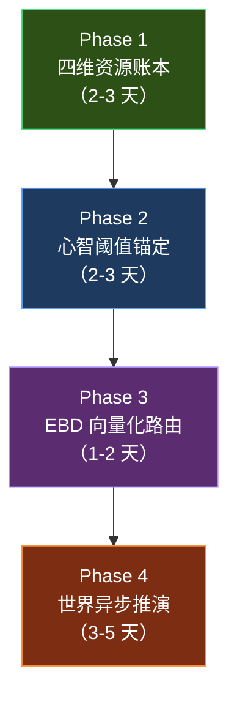

# DeepNovel 下一代迭代深度分析报告

> 基于对全部 **31 个创作流节点**、**12 套 Prompt 模板**、**CreationState（196 行）**、**schema.sql（171 行）**、**人性逻辑库（13 套逻辑）**、**EBD 双轴系统**、**高维博弈教义**的逐行完整阅读后撰写。

---

## 一、当前架构的真实能力边界（Where We Really Stand）

### 1.1 已经做到了什么（Strengths — 不需要动）

| 系统能力 | 实现位置 | 成熟度 |
|---|---|---|
| **EBD 双轴追踪**：情感纽带度 + 客观针对度（两条独立的 -100~+100 轴） | `emotional_bond_doctrine.py` → `bible_update_node` `apply_ebd_delta` | ⭐⭐⭐⭐⭐ |
| **人性逻辑库**：13 种可执行的"思维程序"（设局、忍辱、绝境、马基雅维利…） | `human_logic_lib.py` → `expand1_node` `logic_analysis` 段 | ⭐⭐⭐⭐⭐ |
| **伏笔生命周期**：`latent → building → ready` 三段 urgency + mention_count + 独立 `foreshadow_entries` 表 | `bible_update_node` L586–683 → `foreshadow_entries` 表 | ⭐⭐⭐⭐ |
| **行动意图硬承接**：上章结尾 200 字 → `last_action_intent` → 下章 expand1 强约束 | `bible_update_node` L437–451 → `expand1_node` L167–184 | ⭐⭐⭐⭐ |
| **多层级自动审稿**：expand → write → tension_check → auto_review；对话占比量子门 | `tension_check_node` + `auto_review_node` | ⭐⭐⭐⭐ |
| **势力卡/浮动配角的卷级出场控制** | `faction_cards` 表 + `expand1_node` L310–332 | ⭐⭐⭐ |
| **心智三维度**：`current_mental_state` / `mental_growth_path` / `reverse_scale` | `entity_cards.data_json` → `expand1` 注入 | ⭐⭐⭐ |
| **变量弹性法则**：日常按数值、极端按人性逻辑 | `variable_elasticity.py` → expand1/write 系统提示 | ⭐⭐⭐⭐ |

### 1.2 当前架构的真实瓶颈（Pain Points — 需要进化）

> [!IMPORTANT]
> 以下每一条都来自对代码的**逐行审计**，不是理论空谈。

#### 瓶颈 A：资源因果的"物理真空"

当前系统在 `expand1` 的 `how.resolution_trigger` 中会要求 LLM 写出"破局链如何触发"，在 `path_gen` 的 `resolution_method` 中会标注四种破局类型（提前察觉/局中挣扎/贵人相助/信息差反制）。

**但没有任何代码层面的校验机制来确保主角真的"有"那个破局所需的资源。**

例子：
- `expand1` 说主角用"信息差反制"破局 → 但 State 里没有追踪主角知道哪些信息
- `path_gen` 说"主角利用之前积累的人脉" → 但没人验证主角在之前章节是否真的建立了该人脉
- 唯一的软约束是 `expand1` Prompt 里的一句"禁止无铺垫空降神技" → 但这完全依赖 LLM 的记忆力

**白皮书映射**：白皮书核心论述——"任何破局必须消耗可溯源的因果资产"，目前在架构层是**空转**的。

#### 瓶颈 B：世界的"观察者效应"

当前的 `world_build_node` 在 synopsis 确认后生成一次世界设定卡（`basic_rules`, `power_structure`, `geography`, `world_taboos`, `unique_settings`），之后**锁定不变**（代码注释明确写着"全书不变"）。

势力卡（`faction_cards`）在 `expand1_node` L310–332 中通过简单的字符串匹配（`f.get("name") in node_text`）决定是否注入当前章节。

**问题在于**：
- 势力没有自己的"战略时钟"——它们不会独立行动，只在主角的镜头扫过时才被激活
- `entity_cards` 中反派的 `targeting_degree`（针对度）只通过 `bible_update` 在**主角正文写完后**被动更新
- 没有任何机制让反派在主角不在场时"暗中做事"，然后让主角被这个结果打个措手不及

**白皮书映射**：白皮书要求"去主角中心化的多智能体沙盘"，但当前每一个势力都是"薛定谔的猫"——主角不看它，它就不存在。

#### 瓶颈 C：心智属性的"装饰性"存在

`current_mental_state`、`mental_growth_path`、`reverse_scale` 三个字段确实存在于 `entity_cards.data_json` 中，并在 `expand1_node` 的 `_mental_profile_block_for_expand1()` 和 `auto_review_node` 的 `_format_char_cards()` 中被注入 Prompt。

**但它们目前只参与"描写指导"，不参与"大纲决策"。**

具体来说：
- `story_arc_plan_node` 在规划三幕五卷时，**完全不读取**任何角色的心智状态
- `event_chain_gen_node` 在生成事件链时，**完全不读取**心智属性
- `path_gen_node` 在拆章时，**完全不读取**心智属性
- 只有 `expand1_node`（章级 3W1H 分析）和 `write_node`（正文写作）才注入心智信息

结果：大纲层面的剧情走向与角色当前的心智阈值**完全解耦**。一个刚经历背叛、处于极端易怒状态的主角，依然可能被大纲规划去"隐忍潜伏"——因为大纲规划器根本不知道他现在的心智状态。

**白皮书映射**：白皮书核心论述——"人格驱动轨迹"，要求角色的心理阈值直接影响剧情的分叉走向。

#### 瓶颈 D：EBD 双轴的"末端陷阱"

EBD 系统本身设计精妙（8 种 bond_kind、情境绑定铁律、ebd_crack 机制），但在 Graph 执行流中的位置导致了一个结构性问题：

```
expand1 → expand2 → write → tension_check → [review] → bible_update (EBD 结算在这里)
                                                            ↓
                                                        update_weight → expand1 (下一章)
```

EBD 的变化只在 `bible_update_node` 中被结算（`apply_ebd_delta`），而 `expand1_node` 在生成当前章时读取的是**上一章结算后的 EBD**。

**这意味着同一章正文中发生的关系剧变，不会影响该章本身的后半段行为约束**。整个章节用同一个静态 EBD 快照驱动。如果女主在章中段从 +80 跌到 -20（因为发现主角杀了她父亲），但 expand1 给出的行为约束会一直是 +80 的"深度信任"。

---

## 二、四大迭代方向的深层解剖

### 方向一：四维因果资产账本（Karmic Ledger）

#### 核心构想

在 `CreationState` 中建立一个显性的、结构化的 **资源清单（Resource Inventory）**，追踪主角在故事中真实积累的"因果资产"。

#### 具体数据结构

```python
# schemas/state.py 新增
protagonist_resources: dict  # 四维资源账本
# 结构：
# {
#   "information": [
#     {"id": "info_001", "content": "知道张三是内鬼", "source_seq": 5,
#      "reliability": "confirmed", "expiry": null}
#   ],
#   "leverage": [
#     {"id": "lev_001", "content": "掌握李四贪污证据", "source_seq": 8,
#      "target": "李四", "strength": "致命", "used": false}
#   ],
#   "time_advantage": [
#     {"id": "time_001", "content": "比对手提前3天知道换届消息", "source_seq": 12,
#      "deadline_seq": 15}
#   ],
#   "geography": [
#     {"id": "geo_001", "content": "掌握后山密道位置", "source_seq": 3,
#      "location": "后山"}
#   ]
# }
```

#### 嵌入点分析（逐节点）

| 生命周期阶段 | 涉及节点 | 改动方式 |
|---|---|---|
| **采集** | `bible_update_node` | 在 LLM 提取 `entity_updates` 的同时，新增 `resource_acquisitions` 字段；LLM 从正文中识别主角新获得的信息/杠杆/时间/地理优势，写入 `protagonist_resources` |
| **注入** | `expand1_node` | 在 `ability_section` 之后追加 `resource_section`，将当前资源清单注入 Prompt，让 LLM 在设计破局时**必须从清单中选用** |
| **消耗校验** | `tension_check_node` 或新建 `resource_check_node` | 在 write → bible_update 之间，**代码层面**检查：如果本章的破局类型是"信息差反制"，则正文中必须出现至少一项 `reliability=confirmed` 的 information 资源被消耗的痕迹；否则打回重写 |
| **过期** | `bible_update_node` | 对有 `deadline_seq` 的资源（时间差），在 seq 到达后自动标记为 `expired` |

#### 关键设计决策

> [!WARNING]
> **不能让 LLM 自行管理资源清单**。LLM 的"记忆"是不可靠的。资源的增删必须由代码侧的结构化数据驱动，LLM 只负责从正文中**提取**新资源和**标注**哪条资源被使用。

#### 与白皮书的精确对齐

白皮书原文："主角的每一次突破，都必须消耗此前积累的因果资产——信息差、人际杠杆、时间窗口、地理优势。"

资源账本直接落地了这个要求：**没有账本余额，就没有破局资格**。


### 方向二：异步世界推演（World Tick）

#### 核心构想

在 Graph 中引入一个**不生成正文**的推演节点 `world_tick_node`，专门模拟主角"镜头外"的世界变化。

#### 触发时机分析

通过审计 `graph.py`，最合适的插入点有两个：

**方案 A**：每个 `bible_update → update_weight` 之间（章级粒度）
```
bible_update → [world_tick] → update_weight → expand1
```
- 优点：世界变化粒度最细，每章都有
- 缺点：LLM 调用量翻倍（每章多一次推演）

**方案 B**：在 `update_weight` 检测到 `batch_done` 时（批级粒度，推荐）
```
update_weight → batch_done → [world_tick] → human_review_batch / auto_review
```
- 优点：推演频率合理（每 3–6 章一次），与"势力的战略时钟"节奏匹配
- 缺点：章内无法感知世界变化

**建议采用方案 B 为主、方案 A 为辅**：正常批次用 B；当 `event_chain` 有标记为"高潮"或"转折"的节点时，临时切换为 A（对那一章做世界推演）。

#### 推演节点的数据流

```python
async def world_tick_node(state: CreationState, writer: StreamWriter) -> dict:
    """
    不生成正文。读取所有faction_cards + 反派entity_cards，
    让 LLM 模拟"在主角不知情的情况下，各势力各自做了什么"。
    结果写入 world_timeline_events 表和 entity_cards 的 targeting_degree 更新。
    """
    # 1. 读取当前所有势力卡 + 反派/中立者的人物卡
    # 2. 读取上一批正文的核心事件摘要（entity_summary）
    # 3. 让 LLM 推演：
    #    - 反派 A 基于其 motivation + 当前 targeting_degree，下一步会做什么？
    #    - 势力 B 和势力 C 之间的利益冲突如何演化？
    #    - 有哪些"余波"会波及到主角的活动区域？
    # 4. 将推演结果结构化存储：
    #    - world_events: [{event, participants, impact_on_protagonist}]
    #    - targeting_degree 调整
    #    - 新伏笔种子（planted_foreshadows 新增条目）
    # 5. 关键：推演结果要在下一批 path_gen/expand1 中被注入！
```

#### 推演结果的消费链路

```
world_tick 产出 → world_timeline_events 表
                    ↓
                path_gen_node: 新增 world_events_section 注入 Prompt
                    ↓
                expand1_node: 新增"主角发现世界变化的痕迹"式场景设计
```

> [!TIP]
> **世界推演的最大价值不是增加文字量，而是让主角面临的危机从"被作者安排"变成"被世界撞上"**。读者会感觉到：这个危机不是为了主角而存在的，是世界本身在运转，主角不幸撞了上来。这是"去主角中心化"的本质。

### 方向三：心智阈值锚定大纲（Mental Threshold Routing）

#### 核心构想

将心智属性从"expand1/write 的描写指导"提升为"story_arc/event_chain/path_gen 的大纲决策因子"。

#### 需要改动的节点（影响面分析）

| 节点 | 当前状态 | 改动内容 |
|---|---|---|
| `story_arc_plan_node` | 完全不读取心智 | 去除原有的「蔑视名单（untouchable_characters）」等人为安排的安全屋/不可接触设定，全面改用基于**实体因果**（如阶级壁垒、资源差距）的客观推演。 |
| `event_chain_gen_node` | 事件受主观意图干预 | **因果事件链的基石重构**：事件链必须带有**绝对的客观性**。系统不能基于主角的心智状态或为了让主角「受辱」而刻意设计事件。事件是建立在【因果逻辑与规律（天道、阶梯、社会资源网）】撞击下的必然。 |
| `path_gen_node` | 完全不读取心智 | 传递客观事件链的压力。主角是被动裹入还是主动反扑，取决于事件落点。 |
| `expand1_node` | 心智属性仅用于描写指导 | **心智反噬场景生成**：在这里（场景层面），依据主角客观遭遇的事件，结合其 `current_mental_state`（成熟度）和 `reverse_scale`，推演出主角的**具体应对方式**。例如，「受辱」是主角由于实力不足而在客观事件中遭遇的**客观结果/场景生态**，绝对不能反过来为了让主角受辱而专门设计一个叫「受辱型」的事件！ |
| `bible_update_node` | 追踪但不量化 | 新增 `mental_maturity_score`（0–100）与精神维度的更新，记录每一次经历带来的心智磨砺。 |

#### 心智量化方案

```python
# entity_cards.data_json 中新增：
{
    "mental_maturity_score": 35,  # 0=极幼稚/冲动  100=极成熟/果决
    "tolerance_threshold": 60,    # 当前能承受的压力上限（越低越容易失控）
    "reverse_scale_triggered": false,  # 逆鳞是否已被触发（一旦触发，强制走绝境逻辑）
    "mental_state_history": [
        {"seq": 1, "score": 30, "event": "初入困境"},
        {"seq": 8, "score": 45, "event": "首次成功破局后成长"},
        {"seq": 15, "score": 25, "event": "遭受背叛，心智回落"}
    ]
}
```

#### 客观事件与主观场景的彻底切割（核心纠偏）

系统设计绝不能带有"作者强行喂屎"的视角（即为了让主角吃亏而设计事件），必须建立真正的**动态客观沙盘**：

**1. 废除 "蔑视名单 (untouchable_characters)"**
大纲级别的不可接触者名单是一种典型的"套路干预"。一个高维存在是否出手拍死主角，应该取决于**因果逻辑**（主角是否侵犯了其利益、其是否察觉），而不是一个锁死的属性名单。事件链必须通过物理逻辑运算，而非设定护身符。

**2. 事件的客观属性定义**
在 `event_chain_gen_node` 生成事件时，事件只能是由于各方资源博弈、世界法则运转产生的客观冲突。
例如：
- **正确（客观推演）**："宗门分发月例，内门弟子动用特权缩减了外门配额" -> 这是基于资源分布规律的客观事件。
- **错误（套路干预）**："主角被大师兄刁难受辱" -> 这是主观目的论，本末倒置。

**3. 人格驱动的是"反应与代价"**
在 `expand1_node` 的场景设计中，读取主角的 `mental_maturity_score` 和 `reverse_scale`：
- 若成熟度极高：面对上述宗门月例事件，主角会隐忍、表面称臣，以此获取信息或搜集对方把柄（"忍辱"成了手段）。
- 若逆鳞被触/成熟度低：主角会当场暴起伤人，随后遭到更高层的残酷绞杀（付出惨痛代价）。

**这就是白皮书所说的"人格驱动轨迹"的精准落地**：事件负责释放客观倾轧的压力，角色心智负责决定如何破局和支付多少反制代价。在因果闭环里，没有人是为了受辱而存在的。


### 方向四：EBD 向量化路由（Vector-based Routing）

#### 核心构想

将 EBD 双轴从"注入 Prompt 的文本约束"提升为"Graph 的条件分支决策因子"。

#### 当前 Graph 路由的局限

审计 `graph.py` 后发现，当前所有条件分支都是**流程控制型**的：
- `path_approved` → expand1 / path_gen
- `chapter_approved` → bible_update / expand2 / expand1
- `expand1_approved` → expand2 / expand1
- `_is_batch_done` → batch / continue

**没有任何分支是基于"剧情状态"的。** 所有剧情相关的决策都被下放给了 LLM。

#### EBD 驱动的路由方案

在 `expand1` 之前增加一个轻量的 **`scene_router_node`**（不调用 LLM，纯代码运算）：

```python
async def scene_router_node(state: CreationState) -> Command:
    """根据当前章涉及人物的 EBD 向量，决定走哪个 expand 变体。"""
    current_node = state["story_path"][state["current_node_index"]]
    key_chars = current_node.get("key_characters", [])

    # 从 DB 读取涉及人物的最新 EBD + TD
    cards = await get_character_cards_with_tendencies(project_id, key_chars)

    # 检测"极端冲突条件"：EBD > 60 但 TD > 70（爱恨交织的高维博弈）
    extreme_pairs = [
        c for c in cards
        if abs(c.get("ebd_to_protagonist", 0)) > 60
        and c.get("targeting_degree", 0) > 70
    ]

    if extreme_pairs:
        # 路由到专门的"极端冲突推演"节点
        return Command(
            update={"extreme_conflict_chars": extreme_pairs},
            goto="extreme_conflict_expand"
        )

    # 检测"逆鳞碰撞条件"：某角色的 reverse_scale 在本节点会被触发
    # ...

    # 默认走普通 expand1
    return Command(goto="expand1")
```

#### 专项节点 `extreme_conflict_expand`

这个节点的 System Prompt 完全不同于普通 `expand1`：

- 不需要 `__step_1_自省` 等通用验证
- 专注于白皮书中描述的**"爱与杀戮并存的高维心理博弈"**
- 强制要求每个极端人物写出"表面行为 vs 真实意图 vs 身不由己的原因"三层
- 对话设计要求全部是**潜台词型**——说的每句话都有两层含义

> [!NOTE]
> 这种路由机制的价值在于：**不同类型的场景用不同的 Prompt 专家**。通用 expand1 是一个"万能工具"，但极端博弈场景需要的是一把"手术刀"。让 Graph 在代码层面自动选择正确的工具，比在通用 Prompt 里塞无数条例要有效得多。

---

## 三、迭代优先级与实施路径



### Phase 1 优先的理由

1. **改动最小**：只需在 `bible_update_node` 中新增一个 LLM 字段、在 `CreationState` 中新增一个 dict、在 `expand1_node` / `tension_check_node` 中各加一段注入/校验逻辑
2. **价值最大**：直接解决"凭空破局"这个读者最容易感知的问题
3. **风险最低**：不改变 Graph 拓扑结构，不新增节点，只是在现有节点中增加数据流
4. **验证最快**：生成几章就能看到效果——主角在第 5 章用了一条第 2 章获得的信息来破局，这种"草蛇灰线"的感觉立刻可验证

### Phase 4 最后的理由

1. **改动最大**：需要新增 Graph 节点、新增 DB 表、改动 `path_gen` 和 `expand1` 的 Prompt
2. **调试最难**：异步推演的质量高度依赖 LLM 对"反派策略模拟"的能力，需要大量 Prompt 工程
3. **依赖前三个 Phase**：世界推演产出的"余波"需要被资源账本捕获、需要触发心智阈值变化、需要改变 EBD 双轴值——它是前三个系统的"上游数据源"

---

## 四、关键约束与避坑指南

> [!CAUTION]
> 以下约束来自对现有代码的深度理解，违反任何一条都可能导致系统性崩溃。

### 4.1 State 兼容性

`CreationState` 的任何新增字段必须有默认值（`TypedDict` 中未赋值的字段在 `state.get()` 时返回 `None`）。已有项目的 checkpoint 中不会包含新字段，所有新逻辑必须用 `state.get("xxx") or default` 兜底。

### 4.2 Graph 拓扑约束

绝对不能在 `Command(goto=...)` 的节点上叠加 `conditional_edges`，否则会触发 `InvalidUpdateError`。当前已有多处注释警告这一点（见 `graph.py` L164、L188–194、L196–197）。新增节点如果用 `Command(goto=...)` 出队，就不能再挂静态边。

### 4.3 LLM 调用预算

当前每章的 LLM 调用链约为：`expand1(1) + expand2(1) + write(1) + tension_check(1) + bible_update(2~3) + [auto_review(1~2)]` ≈ **7–9 次**。新增的 `resource_check` 和 `world_tick` 每个需要 1 次 LLM 调用。需要控制总调用量不超过 **12 次/章**，否则成本和延迟不可接受。

### 4.4 Prompt 注入长度

`expand1_node` 的 system prompt 已经很长（`EXPAND1_SYSTEM` + `FULL_OPPONENT_DOCTRINE` + `VARIABLE_ELASTICITY` + `LIVING_COMPANION_RULES` + `DEEPNOVEL_LITERARY_CONSTITUTION` + `ADVANCED_LITERARY_RULES`）。新增的资源清单和世界事件注入必须**精简**，建议用 `entity_summary` 式的轻量摘要而非完整 JSON。

---

## 五、总结：从"约束纺织机"到"活体物理引擎"

| 维度 | 当前架构 | 迭代后架构 |
|---|---|---|
| **破局的合法性** | LLM 自觉 + Prompt 提醒 | **代码层面的资源交易校验** |
| **世界的独立性** | 主角镜头外的势力是静态的 | **异步世界推演生成暗流** |
| **人格对剧情的控制力** | 心智属性只指导描写 | **心智阈值直接劫持大纲分支** |
| **关系危机的处理精度** | 通用 expand1 处理所有场景 | **EBD 向量自动路由到专项推演器** |

> 一句话总结：**不动一行现有的稳定生成逻辑，只在 Graph 的关节处增加"物理校验门"和"数据注入源"**。让 LLM 依然负责创意，但代码负责**因果守恒**。
